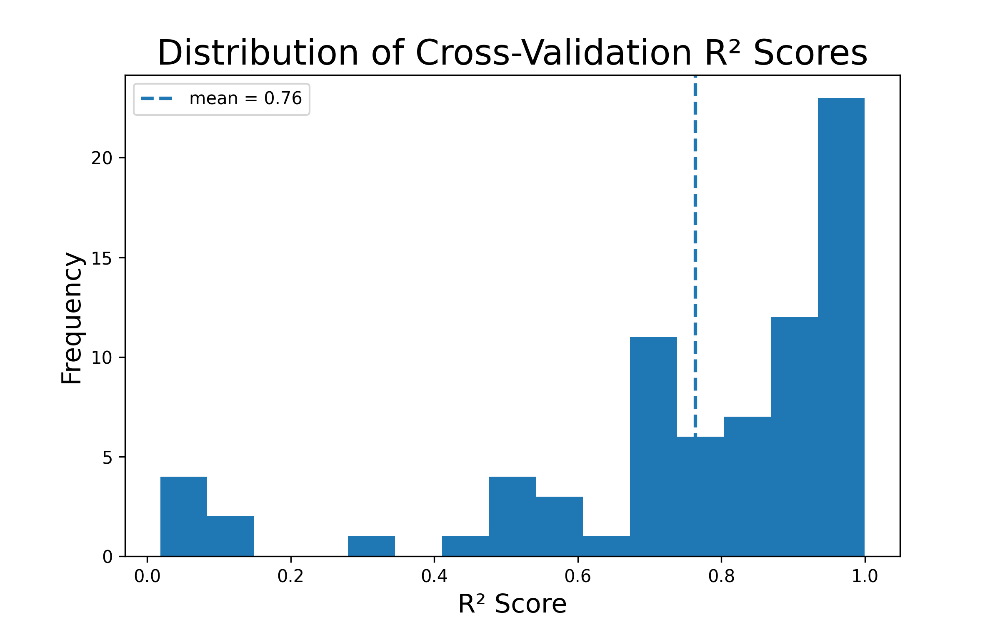

# Crop Yield Prediction with Stability-Aware Diagnostics

#### Random Forest Regression on Weather, Soil, and Spatial-Temporal Heuristics

## Overview
This project implements an end-to-end machine learning pipeline for predicting crop yields using heterogeneous environmental data, including:
- Weather observations
- Soil chemical and physical laboratory measurements
- Spatial information derived from TIGER state polygons
- Historical crop yield records

### Key metrics
- **Mean CV R^2: 0.77 ± 0.26 (std. dev.)**
- Mean R^2 vs. High-Variance Fraction Correlation: -.32 ± 0.37 (std. dev.)
- Mean Train-Test Similarity: .98

## Engineering Highlights:
- End-to-end reproducible pipeline
- Dual-stage leakage protection (GroupShuffleSplit + GroupKFold)
- Deterministic feature engineering via custom transformers
- Custom state-level groupwise imputers
- Geospatial feature engineering via TIGER polygon spatial joins
- Modular diagnostics framework for fold-level and neighborhood analysis
- Modular diagnostics framework for model failure analysis
- Custom mixed-feature distance metrics to preserve numeric smoothness in mixed-feature spaces and analyze data geometry
- Detection of unstable CV folds via local target variance analysis
- Explicit separation of model error versus structural unpredictability
- Verbose logging with fold-level transparency
- Fail-fast data validation across pipeline stages
- Persisted intermediate datasets for reproducible diagnostics
- Centralized path configuration for environment portability

The core modeling approach uses a Random Forest Regressor accompanied by a structured diagnostic framework. The pipeline explicitly analyzes local target instability, fold-level performance variation, and train-test similarity in mixed feature spaces. This work demonstrates the integration of heterogeneous datasets, performance of robust feature engineering, and implementation of rich model diagnostics.

The outcome of this project is both a predictive model and a structured investigation into where and why predictive accuracy varies. This work was created to demonstrate predictive accuracy, applied ML reasoning, a deep understanding of how the data behaves and its implications for modeling, and production-aware pipeline design.

## Authorship and Contributions:
This project was primarily designed, implemented, and analyzed by bellaBoecking.

Additional contributions:
- [**tylrdnns**](https://github.com/tylrdnns) - Preliminary Supabase access setup; selection of raw features; early derived-feature calculations; core dataframe joins during early preprocessing; initial logging scaffolding and application entry-point ('main') setup.

All final feature definitions, refactored feature engineering, pipeline architecture and integration, modeling, evaluation, diagnostics, and documentation were completed by Bella.

## Problem Setting
Some of the challenges faced during the project's construction include:
- Coarse spatial alignment (soil samples vs. state-level yield data)
- Temporal mismatch between sampling and reported yields
- Neighborhoods of high target variance, where predictive accuracy is structurally limited
- Mixed numeric and categorical feature spaces

The project explicitly models and measures local violations of smoothness assumptions instead of assuming i.i.d or smooth target behavior everywhere, quantifying where smoothness fails and connecting it to model uncertainty.

## Data Sources:
Data is retrieved from Supabase-backed tables and merged via left joins to preserve observational integrity and prioritize weather data:
- Weather and soil samples (weather_soil_samples)
- Soil chemical properties (ssurgo_lab_chemical_properties)
- Soil physical properties (ssurgo_lab_physical_properties)
- Crop yield records (nass_crops)

### Spatial Enrichment
Soil samples are assigned U.S. labels via point-in-polygon joins using TIGER shapefiles, reprojected to WGS84 (EPSG: 4326). State-level matching is treated as a coarse spatial proxy, not a claim of fine-grained spatial alignment.

## Matching Logic: Soil -> Crop Yield
Each soil-weather observation is matched to historical crop yields using appropriate spatial and temporal heuristics:
- Crops: CORN, SOYBEANS, WHEAT, COTTON, BARLEY
- Years: 1948-2025
- Fallback: Closest prior year if no match exists within the window

A single soil sample may generate multiple training rows (one matched per crop-year), which motivates group-aware splitting downstream.

## Feature Engineering

### Raw Features:
- Weather aggregates (temperature, precipitation, humidity, GDD)
- Soil chemistry (pH, carbon, nitrogen, CEC, base saturation)
- Soil texture and physical structure
- Spatial coordinates and sample year

### Derived Features:
Deterministic, domain-informed features added via a custom transformer
- soil_quality_score (composite heuristic)
- temp_optimality (distance from agronomic optimum)
- ca_mg_ratio
- gdd_suitability (crop-specific categorical feature)
No learned parameters are introduced at this stage; all derivations are reproducible and pipeline-safe.

## Preprocessing and Leakage Control

### Group-Aware Imputation
Missing values are imputed within state groups, with global fallbacks where necessary.
- Numeric features -> state-level medians
- Categorical values -> state-level modes
This technique avoids leakage across spatial regions while remaining robust to sparsely populated groups.

### Encoding and Scaling:
- Numeric features: standardized
- categorical features: one-hot encoded with safe handling of unseen categories

All preprocessing occurs inside a single scikit-learn pipeline, ensuring identical transformations across folds.

## Model
Estimator: RandomForestRegressor
Tuning: Grid search over depth, tree count, and split parameters
Scoring: R^2
Cross-Validation: GroupKFold using soil sample IDs (pedlabsampnum)

Group-aware splitting ensures that no soil sample appears in both training and validation sets, even when matched to multiple crop years.

RandomForestRegressor was chosen for its ability to capture non-linear relationships, handle mixed feature types, computational efficiency, and favorable performance metrics in multi-model crop yield prediction studies.

## Diagnostics

### 1. Local Target Variance:
For each observation, the project computes Var(Y|X~x) using a custom mixed-feature distance designed to preserve numeric smoothness:
- Numeric features: MinMax-scaled L1 distance
- Categorical features: normalized Hamming distance
- Combined via feature-count-weighted averaging

This avoids discontinuities induced by standard Gower distance while remaining applicable to mixed data.

High local variance regions indicate where predictability is structurally limited by the data.

### 2. Fold-level Instability Analysis
For each cv fold, the pipeline reports:
- RMSE, MAE, R^2
- Normalized target variance
- Target range
- Fraction of samples in high-variance neighborhoods

Folds with unusually low R^2 are explicitly identified and interpreted through the lens of target instability rather than model failure.

### 3. Train-Test Similarity (Gower Diagnostics)
A Gower-based nearest-neighbor similarity analysis quantifies how “familiar” validation samples are relative to training data in each fold.

This separates distributional shift effects from intrinsic target noise, suggesting covariate shift is not the primary driver of high holdout R^2 variance between runs.

### 4. Correlation Analysis
The pipeline computes the correlation between:
- Fold-level R^2
- Fraction of high local variance samples
Provides strong evidence that performance degradation is positively correlated with local instability, not random variance or covariate shift.

## Cross-Validation Performance
Repeated GroupKFold runs show substantial variation in predictive performance. This variability is consistent with the presence of high local-variance target regions.
Mean CV R^2 across runs: **0.77 ± 0.26 (std. dev.)**

## Results Interpretation:
**Local Target Instability**: Fold-level R^2 is negatively correlated with high local variance target regions, suggesting that intrinsic target variability contributes to performance degradation.
-.32 ± 0.37 (mean ± std across 15 runs)

**Covariate Shift**: Gower-based nearest-neighbor similarity between train and validation folds remains consistently high (mean similarity ~ 0.98), indicating that distributional differences between training and validation samples are minimal and are unlikely to explain the observed R^2 variability.
**Structural Limitations**: High-variance neighborhoods set structural limits on predictability.

Model performance is intentionally contextualized:
- Strong average performance does not imply universal predictability
- Diagnostic signals explain where the model can and cannot be trusted
- The model provides strong holdout performance in the majority of runs, but performance degrades when high-variance neighborhoods are unevenly distributed across folds, occasionally resulting in poor validation scores

## Limitations and Future Work
- State-level matching is a coarse spatial proxy
- County or field-level alignment is expected to improve signal quality
- Explicit spatial-temporal kernels could replace heuristics
- Diagnostics can be extended into uncertainty-aware prediction intervals
